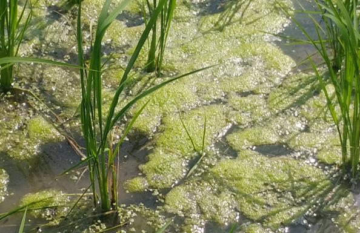
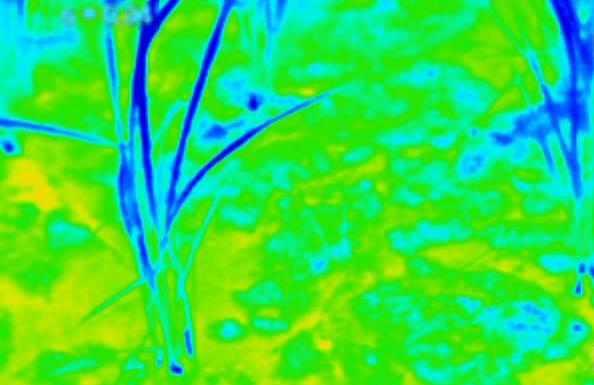
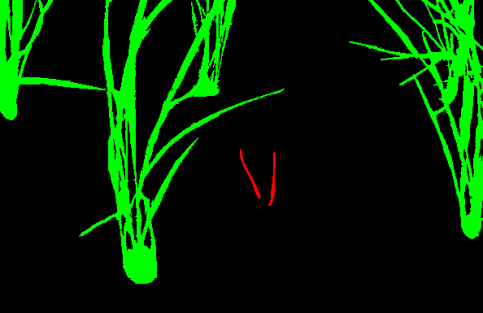
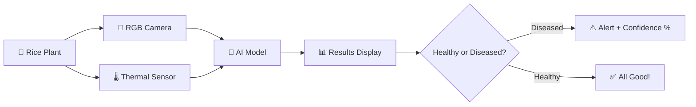

<div align="center">

# 🌾 Thermal AI-Powered Plant Health Screening System

### *Bringing AI to the Farm - Disease Detection at the Edge*

[](https://mitwpu.edu.in/)
[](https://www.python.org/)
[](https://www.tensorflow.org/)
[](https://www.st.com/)
[](LICENSE)

**Real-time plant disease detection using RGB + Thermal imaging on embedded hardware**

[Features](#-features) • [Screenshots](#-screenshots) • [How It Works](#-how-it-works) • [Performance](#-performance) • [Deploy to STM32](#-deploying-to-stm32) • [Team](#-team)

---

</div>

## 🎯 The Problem

Plant diseases cause **10-40% loss** in global crop yields annually. Traditional detection methods are:
- ❌ Subjective and inconsistent
- ❌ Labor-intensive
- ❌ Too late (symptoms visible only after significant damage)
- ❌ Require expertise most farmers don't have

## 💡 Our Solution

A **portable, intelligent device** that farmers can use right in the field - no cloud, no internet, no PhD required!

<div align="center">

### 📸 RGB Camera + 🌡️ Thermal Sensor + 🧠 AI = Early Disease Detection

</div>

## ✨ Features

<table>
<tr>
<td width="50%">

### 🚀 **Instant Results**
Get disease predictions in **150ms** - faster than you can blink!

### 🎯 **High Accuracy**
**94.79%** accuracy in detecting rice plant diseases

### 💪 **Works Anywhere**
No internet needed - runs 100% on the device

</td>
<td width="50%">

### 🔋 **Low Power**
Efficient embedded design for all-day field use

### 👁️ **Sees the Invisible**
Thermal imaging detects stress before visible symptoms

### 💰 **Affordable**
Uses low-cost hardware accessible to farmers

</td>
</tr>
</table>

## 📸 Screenshots

### System in Action

<div align="center">

<table>
<tr>
<td width="50%">

<p><b>🔧 Complete Hardware Setup</b><br/>STM32H747I-DISCO with RGB camera and thermal sensor</p>
</td>
<td width="50%">

<p><b>📺 Real-time Detection Display</b><br/>Live results showing disease classification with confidence</p>
</td>
</tr>
</table>

</div>

### Sample Dataset

<div align="center">

<table>
<tr>
<td width="33%">

<p><b>✅ RGB </b></p>
</td>
<td width="33%">

<p><b>⚠️ Thermal </b></p>
</td>
<td width="33%">

<p><b>🌡️ OUT PUT</b></p>
</td>
<td width="33%">

<p><b>🌡️ OUT PUT</b></p>
</td>    
</tr>
</table>

</div>

### Training Results

<div align="center">


<p><b>Model Training Performance</b> - Accuracy and Loss over 40 epochs</p>

</div>

### STM32 Deployment

<div align="center">

<table>
<tr>
<td width="50%">

<p><b>🔧 STM32Cube.AI Model Analysis</b><br/>Model optimization and memory footprint analysis</p>
</td>
<td width="50%">

<p><b>⚡ Live Inference Demo</b><br/>Real-time detection in action (~150ms per frame)</p>
</td>
</tr>
</table>

</div>

## 🎨 How It Works


### The Magic Behind the Scenes

1. **📷 Capture**: Dual cameras grab both what you see (RGB) and what you don't (thermal stress patterns)
2. **🔄 Fusion**: Images are combined into a 4-channel input (R+G+B+Thermal)
3. **🧠 AI Processing**: Lightweight CNN analyzes patterns on STM32 microcontroller
4. **⚡ Instant Diagnosis**: Results displayed in ~150 milliseconds

## 🏗️ System Architecture

<div align="center">
```
┌─────────────────────────────────────────────────────────────┐
│                    🖥️ USER INTERFACE                        │
│              4" LCD Touch Display + Results                 │
└─────────────────────────────────────────────────────────────┘
                              ↑
┌─────────────────────────────────────────────────────────────┐
│                  ⚙️ PROCESSING BRAIN                         │
│     STM32H747XI Dual-Core (M7 @ 400MHz + M4 @ 240MHz)      │
│              CNN Inference + Image Processing               │
└─────────────────────────────────────────────────────────────┘
                              ↑
┌──────────────────────────┬──────────────────────────────────┐
│   📸 RGB CAMERA          │     🌡️ THERMAL SENSOR            │
│   OV7670 (640×480)       │     MLX90640 (32×24)             │
│   Visual Symptoms        │     Pre-Symptomatic Stress       │
└──────────────────────────┴──────────────────────────────────┘
```

</div>

## 🧠 AI Model Details

### Architecture at a Glance

| Layer Type | Details | Purpose |
|------------|---------|---------|
| **Input** | 128×128×4 (RGB+Thermal) | Multi-modal data |
| **Conv Block 1** | 32 filters, 3×3 kernel | Edge detection |
| **Conv Block 2** | 64 filters, 3×3 kernel | Texture patterns |
| **Conv Block 3** | 128 filters, 3×3 kernel | Complex features |
| **Dense** | 256 neurons | Feature combination |
| **Output** | 1 neuron (sigmoid) | Disease probability |

### 📦 Two Model Versions Available

| Version | Size | Speed | Use Case |
|---------|------|-------|----------|
| **🎯 Non-Quantized** | ~2 MB | Fast | Training & Development |
| **⚡ Quantized** | <500 KB | Fastest | STM32 Deployment |

> **Note**: Both versions maintain the same architecture - quantized version uses reduced precision for embedded efficiency!

## 📊 Performance

<div align="center">

| Metric | Score | What It Means |
|--------|-------|---------------|
| **Accuracy** | 94.79% | Overall correctness |
| **Precision** | High ⭐ | Few false alarms |
| **Recall** | High ⭐ | Catches most diseases |
| **Inference Time** | 150ms | Real-time capability |
| **Model Size** | <500KB | Fits on microcontroller |

</div>

### 📈 Training Details

- **Dataset**: 100 RGB + 100 thermal image pairs (PlantVillage-derived)
- **Classes**: Healthy vs. Diseased rice leaves
- **Split**: 80% train / 10% validation / 10% test
- **Epochs**: 40
- **Optimizer**: Adam
- **Loss Function**: Binary Crossentropy
- **Augmentation**: Random flip, rotation, zoom

## 🔧 Technology Stack

<div align="center">

### Software


### Hardware


</div>

## 🚀 Getting Started

### Prerequisites
```bash
- Python 3.8+
- TensorFlow 2.x
- STM32CubeIDE
- STM32Cube.AI toolkit
```

### Quick Start
```bash
# Clone the repository
git clone https://github.com/yourusername/thermal-plant-health-screening.git
cd thermal-plant-health-screening

# Install dependencies
pip install -r requirements.txt

# Train the model (non-quantized version)
python train_model.py

# Convert to quantized version for STM32
python convert_to_tflite.py
```

## 📁 Repository Structure
```
📦 thermal-plant-health-screening
├── 📄 README.md
├── 📄 requirements.txt
├── 📂 models
│   ├── 🎯 non_quantized_model.py      # Full precision model
│   └── ⚡ quantized_model.py          # Optimized for STM32
├── 📂 dataset
│   ├── 📸 rgb_images/
│   └── 🌡️ thermal_images/
├── 📂 screenshots                      # Project screenshots
│   ├── hardware_setup.jpg
│   ├── lcd_display.jpg
│   ├── training_accuracy.png
│   └── ...
├── 📂 deployment
│   └── 🔧 stm32_inference/
└── 📂 docs
    └── 📄 research_paper.pdf
```

## 🔌 Deploying to STM32

### Hardware Requirements

- **STM32H747I-DISCO** Discovery kit
- **OV7670** RGB Camera Module
- **MLX90640** Thermal Imaging Sensor
- **4" TFT LCD Display** (MIPI-DSI)
- USB Cable for programming

### Software Requirements

- [STM32CubeIDE](https://www.st.com/en/development-tools/stm32cubeide.html) (Latest version)
- [STM32Cube.AI](https://www.st.com/en/embedded-software/x-cube-ai.html) extension (for AI model conversion)
- [STM32CubeMX](https://www.st.com/en/development-tools/stm32cubemx.html) (for peripheral configuration)

### 📺 Video Tutorial

**Complete step-by-step deployment guide:**

[](https://www.youtube.com/watch?v=grgNXdkmzzQ)

👉 [**Watch: How to Deploy TensorFlow Lite Model on STM32**](https://www.youtube.com/watch?v=grgNXdkmzzQ)

### 📋 Step-by-Step Deployment Guide

#### Step 1: Prepare Your Model
```bash
# Convert Keras model to TensorFlow Lite format
python convert_to_tflite.py

# This will generate: quantized_model.tflite
```

#### Step 2: Install STM32Cube.AI

1. Open **STM32CubeIDE**
2. Go to `Help` → `Manage Embedded Software Packages`
3. Select `STMicroelectronics` → `X-CUBE-AI`
4. Download and install the latest version

#### Step 3: Create New STM32 Project

1. **File** → **New** → **STM32 Project**
2. Select board: **STM32H747I-DISCO**
3. Name your project: `PlantHealthAI`
4. Click **Finish**

#### Step 4: Configure Peripherals (STM32CubeMX)
```
✅ Enable DCMI (Digital Camera Interface) for OV7670
✅ Enable I2C for MLX90640 thermal sensor
✅ Enable LTDC (LCD-TFT Display Controller)
✅ Configure GPIO pins for camera and sensor
✅ Set up DMA for efficient data transfer
✅ Configure UART for debugging (optional)
```

#### Step 5: Import AI Model with STM32Cube.AI

1. In **STM32CubeIDE**, open the `.ioc` file
2. Click on **Software Packs** → **Select Components**
3. Enable **X-CUBE-AI**
4. Go to **Categories** → **Artificial Intelligence**
5. Click **Add network**
6. Browse and select your `quantized_model.tflite` file
7. Click **Analyze** to verify the model
8. Review model details:
   - Input shape: 128×128×4
   - Output shape: 1
   - Flash usage: ~500KB
   - RAM usage: Check activation memory
9. Click **OK** to generate code

#### Step 6: Review Generated Code

STM32Cube.AI will generate:
```
📂 X-CUBE-AI
├── 📄 network.c           # Model implementation
├── 📄 network.h           # Model header
├── 📄 network_data.c      # Model weights
└── 📄 app_x-cube-ai.c     # Application wrapper
```

#### Step 7: Implement Inference Pipeline

Add this code to your `main.c`:
```c
#include "app_x-cube-ai.h"
#include "network.h"

// Buffer for input data (128x128x4)
ai_float input_data[128*128*4];

// Buffer for output data
ai_float output_data[1];

// Run inference
void run_inference() {
    // 1. Capture RGB image from OV7670
    capture_rgb_image();
    
    // 2. Capture thermal data from MLX90640
    capture_thermal_data();
    
    // 3. Preprocess and fuse images
    preprocess_and_fuse(input_data);
    
    // 4. Run AI inference
    ai_network_run(input_data, output_data);
    
    // 5. Get prediction
    float disease_probability = output_data[0];
    
    // 6. Display result on LCD
    if (disease_probability > 0.5) {
        display_result("DISEASED", disease_probability);
    } else {
        display_result("HEALTHY", 1.0 - disease_probability);
    }
}
```

#### Step 8: Configure Memory

In `STM32H747XIHX_FLASH.ld`, ensure sufficient memory allocation:
```ld
MEMORY
{
  FLASH (rx)     : ORIGIN = 0x08000000, LENGTH = 2048K
  RAM (xrw)      : ORIGIN = 0x24000000, LENGTH = 512K
  SDRAM (xrw)    : ORIGIN = 0xD0000000, LENGTH = 32M  /* For activations */
}
```

#### Step 9: Build and Flash
```bash
# Build the project
Right-click project → Build Project

# Flash to STM32
Right-click project → Run As → STM32 C/C++ Application

# Monitor via Serial (optional)
Open Serial Monitor at 115200 baud
```

#### Step 10: Test and Validate

1. **Power on** the STM32H747I-DISCO board
2. **Point cameras** at rice plant leaf
3. **Observe LCD display** for real-time results
4. **Verify inference time** (~150ms expected)
5. **Check accuracy** against known samples

### 🔍 Troubleshooting

| Issue | Solution |
|-------|----------|
| **Model won't analyze** | Check TFLite model format, ensure compatible with STM32Cube.AI version |
| **Out of memory error** | Enable external SDRAM, reduce batch size, or use more aggressive quantization |
| **Slow inference** | Verify Cortex-M7 running at 400MHz, enable CPU caches, use DMA for data transfer |
| **Camera not detected** | Check I2C/DCMI connections, verify power supply, test with simple capture code |
| **Incorrect predictions** | Verify preprocessing matches training pipeline, check input normalization |

### ⚙️ Optimization Tips

- ✅ **Use DMA** for camera data transfer to reduce CPU load
- ✅ **Enable L1 cache** on Cortex-M7 for faster memory access
- ✅ **Place model in external flash** if internal flash is insufficient
- ✅ **Use SDRAM** for activation buffers to save internal RAM
- ✅ **Enable compiler optimizations** (`-O3` flag)
- ✅ **Profile inference time** using STM32CubeMonitor

### 📚 Additional Resources

- [STM32Cube.AI Documentation](https://www.st.com/resource/en/user_manual/um2526-getting-started-with-xcubeai-expansion-package-for-artificial-intelligence-ai-stmicroelectronics.pdf)
- [STM32H747 Reference Manual](https://www.st.com/resource/en/reference_manual/rm0399-stm32h745755-and-stm32h747757-advanced-armbased-32bit-mcus-stmicroelectronics.pdf)
- [TensorFlow Lite Micro Guide](https://www.tensorflow.org/lite/microcontrollers)

---

## 🎯 Applications

- 🌾 **Early Disease Detection** in rice crops (brown spot, leaf spot)
- 🚜 **Precision Agriculture** for optimized crop management
- 📱 **On-Field Diagnostics** for farmers without lab access
- 🌍 **Sustainable Farming** through preventive intervention
- 📊 **Crop Health Monitoring** at scale

## 🔮 Future Roadmap

- [ ] 🌍 Expand to more crop types (wheat, corn, cotton)
- [ ] 🦠 Add more disease categories
- [ ] 📍 GPS integration for farm-wide disease mapping
- [ ] 📡 LoRaWAN connectivity for alerts
- [ ] ☁️ Weather condition adaptation
- [ ] 📱 Mobile app interface
- [ ] 🤖 8-bit quantization for even faster inference

## 👥 Team

<div align="center">

| **Siddhi Singh** | **Ved Raundal** |
|:---:|:---:|
| 👨‍💻 Developer | 👨‍💻 Developer |
| DOEEE, MITWPU | DOEEE, MITWPU |
| [📧](mailto:1032222914@mitwpu.edu.in) | [📧](mailto:1032222638@mitwpu.edu.in) |

</div>

## 📚 Citation

If you use this work in your research, please cite:
```bibtex
@article{dhanve2024thermal,
  title={Thermal AI-Powered Plant Health Screening System},
  author={Dhanve, Shruti and Singh, Siddhi and Raundal, Ved},
  journal={MIT World Peace University},
  year={2024}
}
```

## 🙏 Acknowledgments

- 🏛️ **Department of Electronics and Electrical Engineering (DOEEE)**, MIT World Peace University
- 📊 **PlantVillage Dataset** by Pandian & Geetharamani (2019)
- 🔧 **STMicroelectronics** for STM32Cube.AI tools
- 🌾 Special thanks to agricultural experts for dataset validation

## 📄 License

This project is licensed under the MIT License - see the [LICENSE](LICENSE) file for details.

## 🌟 Star Us!

If you find this project helpful, please consider giving it a ⭐ on GitHub!

---

<div align="center">

**Made with ❤️ for farmers and sustainable agriculture**

[⬆ Back to Top](#-thermal-ai-powered-plant-health-screening-system)

</div>
